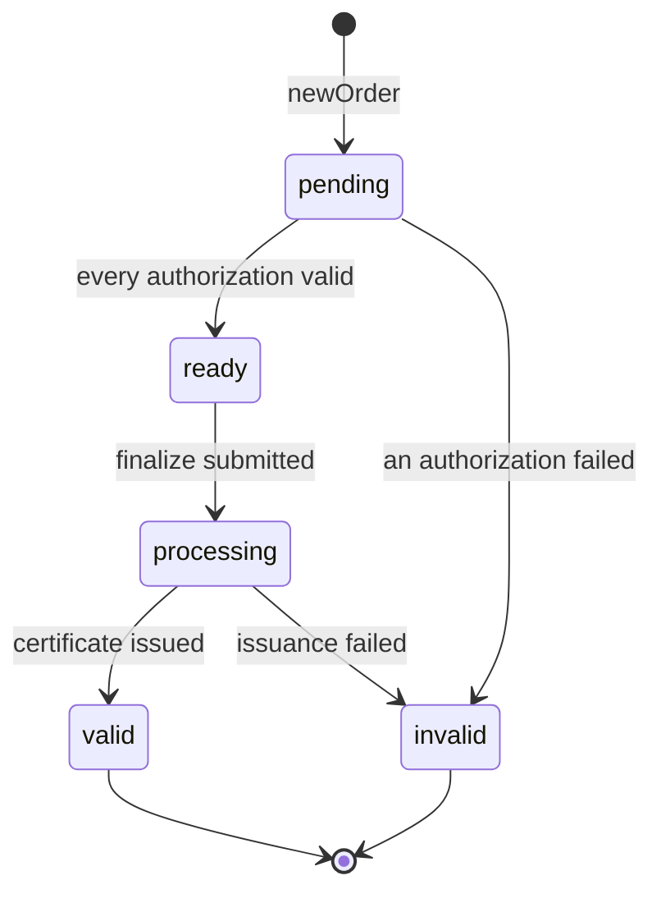
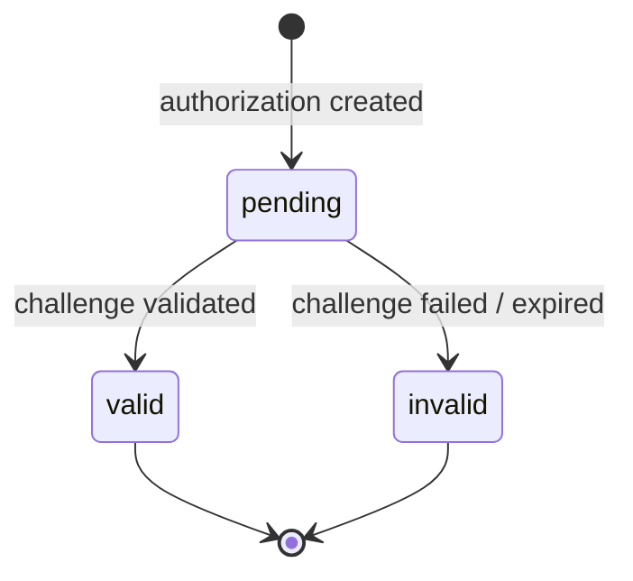
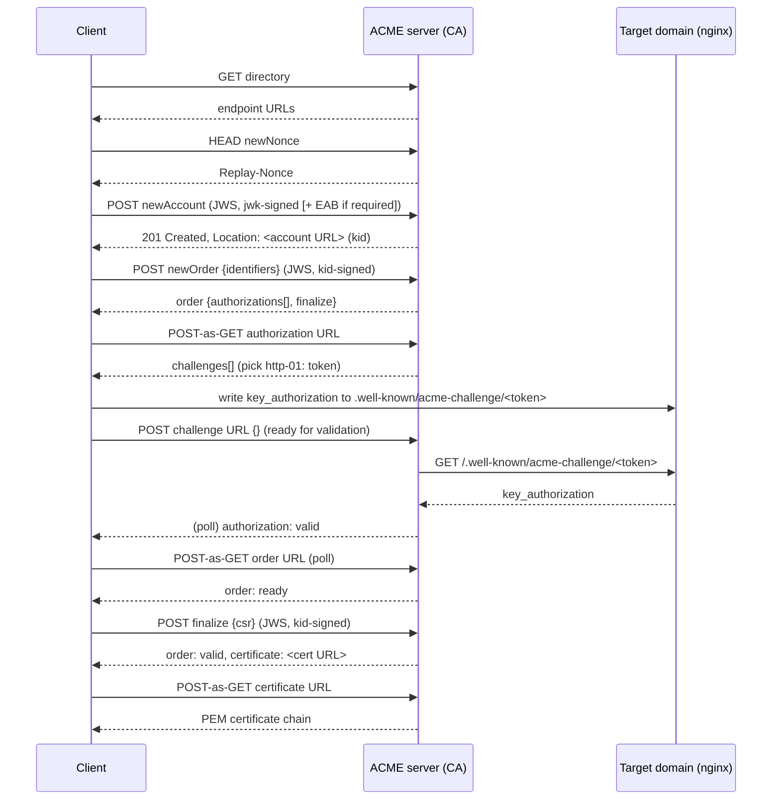

# ACME Protocol Reference (RFC 8555)

_Last updated: 2026-08-17_

This is a protocol-level reference for ACME (Automated Certificate Management
Environment), the spec `cmd/acmeclient` implements to obtain the mavenrepo
nginx front's TLS certificate from the internal CA. It documents the
protocol itself — message format, resources, state machines, the full
issuance flow, and renewal — independent of this repo's specific client. Where useful,
sections point at the exact function in [`cmd/acmeclient/main.go`](../cmd/acmeclient/main.go)
implementing that piece. For *why* this replaced an earlier bespoke design
and how to point it at a specific CA, see
[`architecture.md`](architecture.md) §7 and
[`operator-runbook.md`](operator-runbook.md) §6.

Normative source: [RFC 8555](https://www.rfc-editor.org/rfc/rfc8555). This
document is a practical summary, not a replacement for the RFC — consult it
directly for anything ambiguous below.

---

## 1. Purpose and scope

ACME automates what used to be a manual CA interaction: prove you control a
resource (typically a domain), submit a certificate signing request, receive
a signed certificate. The protocol is CA-agnostic — any CA implementing the
spec interoperates with any conformant client, which is the whole reason
this is worth using instead of a hand-rolled REST integration: the message
shapes, state machine, and security properties are fixed by the spec rather
than something to reverse-engineer per CA.

ACME defines several ways to prove control of an identifier (a *challenge
type*); this document covers HTTP-01 in the most detail since it's what
`cmd/acmeclient` uses, with DNS-01 and TLS-ALPN-01 covered for context.

## 2. Terminology

| Term | Meaning |
|---|---|
| **Directory** | The CA's index of endpoint URLs — where every other resource in this table gets created |
| **Account** | An identity at the CA, keyed by a client-held keypair (not per-certificate) |
| **Order** | One request for a certificate covering a specific set of identifiers (domains) |
| **Authorization** | Per-identifier: the CA's record of whether control has been proven |
| **Challenge** | One accepted method of proving control for an authorization (HTTP-01, DNS-01, TLS-ALPN-01) |
| **Nonce** | A single-use, server-issued value that must appear in every signed request, preventing replay |
| **JWS** | JSON Web Signature ([RFC 7515](https://www.rfc-editor.org/rfc/rfc7515)) — the signed envelope wrapping every ACME request body |
| **JWK** | JSON Web Key ([RFC 7517](https://www.rfc-editor.org/rfc/rfc7517)) — the JSON representation of the account's public key |
| **kid** | "Key ID" — the account's URL, used in place of re-embedding the public key once the account exists |
| **Key authorization** | `token + "." + JWK thumbprint` — the value a challenge response must produce, binding a specific challenge to a specific account key |
| **EAB** | External Account Binding — an extra signature, using a CA-issued out-of-band key, tying a new ACME account to an identity the CA already trusts. Required by some private CAs (step-ca, Vault PKI's ACME support), rare for public ones |

## 3. Transport and message format

Everything is JSON over HTTPS. Every state-changing request — and, per
§6.3 below, every *read* too — is a POST carrying a JWS, not a bare JSON
body with a bearer token. A JWS in flattened form (RFC 7515 §7.2.2) has
three base64url-encoded parts:

```json
{
  "protected": "<base64url(JSON header)>",
  "payload":   "<base64url(JSON body)>",
  "signature": "<base64url(signature over protected + \".\" + payload)>"
}
```

The protected header carries:

| Field | Present when | Purpose |
|---|---|---|
| `alg` | always | Signature algorithm (`ES256` for the account key; `HS256` for an EAB signature) |
| `jwk` | account has no `kid` yet (first request only — `newAccount`) | The account's public key, so the CA can identify it before it has a URL to reference |
| `kid` | every request after account creation | The account's URL, standing in for `jwk` once one exists |
| `nonce` | always | A nonce obtained from the CA (`newNonce`, or the `Replay-Nonce` header of the previous response) — single-use |
| `url` | always | The exact target URL of this request, signed into the envelope so a captured request can't be replayed against a different endpoint |

**ES256 signature encoding**: the JWS spec requires the raw, fixed-width
concatenation of `r` and `s` (32 bytes each for P-256 — 64 bytes total), *not*
ASN.1 DER. This trips up naive implementations that reach for a generic
"sign with ECDSA" helper without checking the output shape.

Implementation: [`signJWS`](../cmd/acmeclient/main.go) (account-key /
ES256) and `signHMACJWS` (EAB / HS256).

## 4. The directory resource

The one URL a client is configured with. `GET`-ing it returns the CA's
endpoint map:

```json
{
  "newNonce": "https://ca.example/acme/new-nonce",
  "newAccount": "https://ca.example/acme/new-account",
  "newOrder": "https://ca.example/acme/new-order",
  "revokeCert": "https://ca.example/acme/revoke-cert",
  "keyChange": "https://ca.example/acme/key-change",
  "meta": {
    "externalAccountRequired": false
  }
}
```

Every other endpoint is discovered from responses (`Location` headers,
fields like `finalize`/`authorizations`/`certificate`), never hardcoded —
this is part of what makes the protocol CA-agnostic rather than needing a
per-CA URL scheme baked into the client.

## 5. Nonces and replay protection

Nonces are the protocol's anti-replay mechanism, independent of TLS:

- A fresh nonce is obtained with `HEAD` (or `GET`) on `newNonce`, returned in
  a `Replay-Nonce` response header.
- Every *subsequent* response — success or error — also carries a fresh
  `Replay-Nonce` header, so a client normally never needs to call `newNonce`
  again after the first request.
- A nonce is single-use. Reusing one gets a `urn:ietf:params:acme:error:badNonce`
  problem response; the client is expected to retry the same request with
  the nonce from *that* error response (which is why the CA hands out a
  fresh one even on failure).

## 6. Resources and their state machines

### 6.1 Account

Created with `POST newAccount`, payload `{"termsOfServiceAgreed": true, ...}`.
The request's protected header embeds the account's public key (`jwk`) since
no `kid` exists yet. On success (`201 Created`), the response's `Location`
header is the account URL — from this point on, every request uses that URL
as `kid` instead of re-sending the public key.

If the directory's `meta.externalAccountRequired` is `true`, the payload
must also include an `externalAccountBinding` member: a *second*, nested
JWS, signed with HS256 using a CA-issued HMAC key, whose payload is the
account's public JWK and whose protected header's `kid` is the CA-issued EAB
key ID. This is how a private CA ties a new ACME account back to an
identity it already provisioned out-of-band, without the account itself
needing pre-existing credentials of the same kind.

Implementation: `ensureAccount`.

### 6.2 Order

Created with `POST newOrder`, payload naming the identifiers wanted:

```json
{"identifiers": [{"type": "dns", "value": "maven.internal.example.com"}]}
```



`processing` is often skipped in practice — many CAs finalize synchronously
and return `valid` directly from the `finalize` response. A client polling
for order status should treat `valid` as terminal-success regardless of
whether `processing` or `ready` was ever observed.

The order response carries `authorizations` (one URL per identifier) and a
`finalize` URL, discovered rather than derived.

Implementation: `newOrder`, `getOrder`.

### 6.3 Authorization and challenge

Fetched with **POST-as-GET**: a JWS-wrapped POST whose `payload` is the
literal empty string `""` (not `base64("")`, not omitted — RFC 8555 §6.3
requires the empty string specifically). This is the mechanism by which ACME
has no unauthenticated reads at all — even polling status is a signed
request.



An authorization lists one or more challenges (different proof methods the
CA is willing to accept); the client picks one and works only with that one.
Each challenge has its own `pending → processing → valid|invalid` sub-state,
but only the parent authorization's status needs to be polled in practice.

An authorization's `valid` status can outlive the order that produced it
(each authorization has its own `expires`, independent of any certificate's
lifetime — commonly on the order of weeks, CA-specific). A *later* order for
the same identifier may then come back referencing that same
already-`valid` authorization, in which case no challenge is needed again —
see §9.

Implementation: `getAuthorization`, `http01Challenge`.

### 6.4 Finalization and certificate download

Once every authorization for an order is valid, the client generates a
certificate key and CSR, then `POST`s the CSR (DER, base64url-encoded) to
the order's `finalize` URL:

```json
{"csr": "<base64url(DER-encoded CSR)>"}
```

The CSR's subject/SANs must match the order's identifiers — the CA does not
trust the client to request a different name than what it already proved
control of. On success the order carries a `certificate` URL; a POST-as-GET
there (with `Accept: application/pem-certificate-chain`) returns the leaf
certificate followed by the issuing chain, all as concatenated PEM.

Implementation: `obtainCertificate` (CSR + finalize), `downloadCertificate`.

## 7. Challenge types

| Type | Proof mechanism | Where it's checked from |
|---|---|---|
| **HTTP-01** | Serve `key authorization` at `http://<domain>/.well-known/acme-challenge/<token>` | The CA's own outbound HTTP request to the domain, over the public network, on port 80 |
| **DNS-01** | Publish `_acme-challenge.<domain>` TXT record containing a hash of the key authorization | The CA's DNS resolver |
| **TLS-ALPN-01** | Present a specially-crafted self-signed cert during a TLS handshake on port 443 with the `acme-tls/1` ALPN protocol | The CA's own TLS handshake to the domain |

**Key authorization**, used by HTTP-01 and as the basis for the other two,
is:

```
key_authorization = token + "." + base64url(SHA-256(JWK_thumbprint(account_public_key)))
```

`token` comes from the CA (part of the challenge object); the thumbprint
(RFC 7638) is computed by the *client* from its own account key. Producing a
correct key authorization requires possessing the account private key, which
is what ties "this specific account requested this" to "this specific domain
responded correctly" — a bare `token` alone wouldn't prove that.

This repo uses **HTTP-01** because nginx already serves plaintext HTTP on
port 80 (for the redirect-to-HTTPS vhost) and can trivially serve a static
file alongside it (`location /.well-known/acme-challenge/` in
`deploy/*/mavenrepo.conf*`) — no DNS API integration or a second TLS
listener needed. DNS-01 is the only option that works for a domain with no
public HTTP endpoint at all (e.g. wildcard certs, or fully internal DNS
namespaces the CA can still resolve); it wasn't needed here.

Implementation: `completeHTTP01` writes the key authorization to the webroot,
`POST`s the challenge URL with `{}` to tell the CA to check, then polls the
authorization until `valid`.

## 8. Full issuance sequence



## 9. Renewal

ACME has no dedicated "renew" call — there is no `renewCert` endpoint, no
concept of a renewal token, nothing analogous to an OAuth refresh token. A
client renews a certificate by running the **exact same flow as §8 again**:
a fresh `newOrder` for the same identifier(s), before the current
certificate expires. This is deliberate — it keeps the protocol to one
issuance path instead of two, and means a client's renewal logic is its
issuance logic, just invoked again on a schedule.

Three things follow from that:

- **Authorization reuse is opportunistic, not automatic.** As noted in §6.3,
  an authorization the CA already validated recently may come back `valid`
  in the new order's `authorizations` list, letting the client skip the
  challenge for that identifier entirely. Whether this happens depends on
  the CA (how long it keeps authorizations valid) and isn't something the
  client can request — it just has to check each authorization's status
  before attempting a challenge, and skip if already `valid`. `obtainCertificate`
  does exactly this (`if az.Status == "valid" { continue }`), so it benefits
  automatically when the CA offers reuse and re-validates from scratch when
  it doesn't — no renewal-specific branch needed.
- **The certificate key does not need to persist across renewals** — and
  generally shouldn't. A fresh keypair each issuance limits the blast radius
  if a key is ever compromised. `cmd/acmeclient` generates a new RSA-2048
  key on every run.
- **The account key must persist across renewals** — it's the client's
  identity at the CA, not the certificate's. Losing it means creating a new
  account (harmless, but loses whatever renewal-window trust a CA might
  extend to an established account under something like ARI, below).
  `cmd/acmeclient` writes it once to `-account-key` and reuses it forever.

**Scheduling is entirely the client's job.** ACME itself has no
push-notification mechanism for "your cert is expiring soon" (aside from an
optional, out-of-band expiry-notification email some CAs send to the
account's `contact` address). A client has to decide when to run, and when
that run should actually contact the CA versus do nothing.

`cmd/acmeclient` handles this by reading the *installed* certificate's real
`NotAfter` on every run (`readCertInfo`/`parseCertInfo`) rather than
assuming any particular lifetime, so the same logic works whether the CA
hands out day-scale or month-scale certificates:

- More than `-notify-before-days` (default 21) remaining: no-op.
- Within `-notify-before-days` but more than `-renew-before-days` (default
  14) remaining: fire `-notify-cmd` once with `NOTIFY_EVENT=renewal_upcoming`
  — a heads-up, deduplicated per certificate serial (`alreadyNotified`/
  `markNotified`) so it doesn't refire on every subsequent daily check before
  renewal actually happens.
- Within `-renew-before-days`: renew for real (§8's flow via `renew`), then
  fire `-notify-cmd` with `NOTIFY_EVENT=renewal_succeeded` (or
  `renewal_failed`, if the attempt errored).

`cert-renew.timer` still runs this daily (`OnCalendar=daily`), but most
invocations are now a local file read and a date comparison — no CA contact
at all — rather than the earlier design's unconditional daily reissuance.

`-force` (`ACME_FORCE_RENEW=true`) is the escape hatch back to that earlier
behavior: it skips the expiry check entirely and renews on every run,
regardless of `-renew-before-days`/`-notify-before-days` or how much
validity remains. An option for operators who'd rather lean on the CA's own
rate limiting (or its absence) than have this tool decide when to renew.

**ARI (ACME Renewal Information, [RFC 9773](https://www.rfc-editor.org/rfc/rfc9773))**
is a newer, opt-in extension addressing a related gap: a `renewalInfo`
directory endpoint lets the CA *itself* suggest a renewal window for a given
certificate (spreading load across clients instead of everyone renewing at a
fixed offset before expiry) and, more importantly, lets it signal that a
certificate needs *immediate* renewal — e.g. after a mass-revocation
incident — without waiting for the client's own schedule to notice.
`cmd/acmeclient`'s day-count thresholds are a client-side, manually-tuned
stand-in for that; it doesn't query `renewalInfo`, so it can't react to a
CA-initiated "renew now" signal between scheduled runs. Worth adopting if
the internal CA supports it.

## 10. Error responses

Failures use `application/problem+json` ([RFC 7807](https://www.rfc-editor.org/rfc/rfc7807)):

```json
{
  "type": "urn:ietf:params:acme:error:badNonce",
  "detail": "JWS has an invalid anti-replay nonce"
}
```

`type` is a URN under `urn:ietf:params:acme:error:*` (`badNonce`,
`rejectedIdentifier`, `unauthorized`, `rateLimited`, `malformed`, etc.) —
clients branch on this, not on HTTP status alone, since (for example) both a
malformed request and an expired authorization can return 4xx without the
type telling you which. `badNonce` is the one error every client is expected
to retry automatically (once), since the same error response hands back the
fresh nonce needed to do so.

Implementation: `acmeProblem`, the retry loop in `postRaw`.

## 11. Security properties, summarized

- **Every write is signed**, not bearer-token authenticated — a leaked HTTP
  log can't be replayed into a forged request the way a leaked
  `Authorization: Bearer ...` header could.
- **The target URL is signed into the request**, so a captured request can't
  be redirected at a different endpoint.
- **Nonces prevent literal replay**, independent of TLS.
- **Key authorizations bind a specific account to a specific challenge
  response**, so control of the domain and possession of the account key are
  both required together — neither alone is sufficient.
- **The CA validates from its own vantage point** (its own HTTP fetch, its
  own DNS resolution) — the client only ever *asserts* readiness; it can't
  submit third-party evidence.

## References

- [RFC 8555 — Automatic Certificate Management Environment (ACME)](https://www.rfc-editor.org/rfc/rfc8555)
- [RFC 7515 — JSON Web Signature (JWS)](https://www.rfc-editor.org/rfc/rfc7515)
- [RFC 7517 — JSON Web Key (JWK)](https://www.rfc-editor.org/rfc/rfc7517)
- [RFC 7638 — JSON Web Key (JWK) Thumbprint](https://www.rfc-editor.org/rfc/rfc7638)
- [RFC 7807 — Problem Details for HTTP APIs](https://www.rfc-editor.org/rfc/rfc7807)
- [RFC 9773 — ACME Renewal Information (ARI) Extension](https://www.rfc-editor.org/rfc/rfc9773)
- [`cmd/acmeclient/main.go`](../cmd/acmeclient/main.go) — this repo's implementation
- [`cmd/acmeclient/main_test.go`](../cmd/acmeclient/main_test.go) — includes an end-to-end test against a mock ACME server that verifies real signatures over the full flow above
