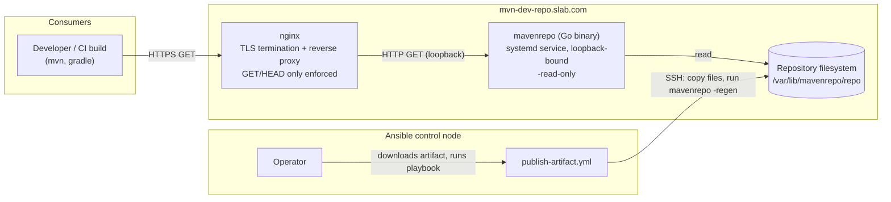
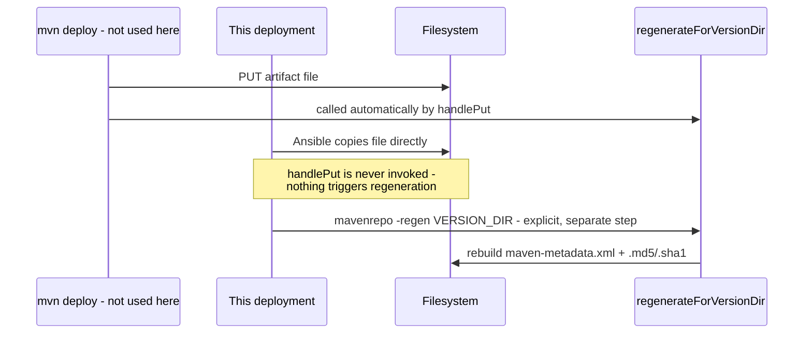
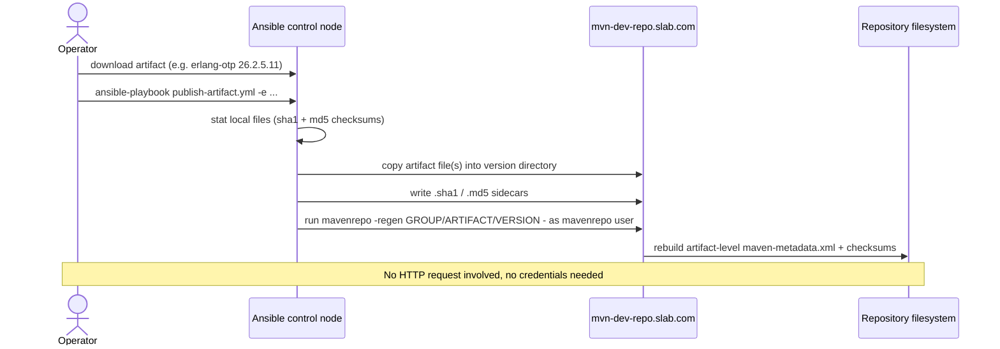

# mavenrepo — Architecture

Status: **Draft for review**
Scope: `mavenrepo` (this repo's Go server) as deployed to `mvn-dev-repo.slab.com`
Audience: peer reviewers familiar with the codebase or willing to read `main.go`

For day-to-day setup/operation tasks rather than design rationale, see
[`operator-runbook.md`](operator-runbook.md).

## 1. Purpose

Host Maven artifacts that aren't available from public repositories (Maven
Central, etc.) — third-party downloads an operator has vetted, such as an
Erlang/OTP release published under a `groupId`/`artifactId` this org
controls. It is explicitly **not** a general-purpose artifact repository
manager: no proxying/caching of upstream repos, no UI, no RBAC, no support
for arbitrary `mvn deploy` traffic at scale. Where those are needed, the
recommendation is Sonatype Nexus or a similar tool (see
[`maven-repo-runbook.md`](maven-repo-runbook.md)).

## 2. Goals / non-goals

**Goals**
- Serve artifacts to Maven/Gradle clients as a standard-shaped Maven
  repository (correct `maven-metadata.xml`, checksums, directory layout).
- Keep the write surface as small as possible — this repo's contents change
  rarely and are always operator-vetted, so the design optimizes for that,
  not for high-frequency CI-driven publishing.
- Single static binary, no runtime dependencies, minimal operational surface.
- Reproducible, fleet-manageable deployment (Ansible), not a hand-configured
  snowflake host.

**Non-goals**
- Accepting routine `mvn deploy` traffic from CI or developer machines (see
  §6, this was considered and rejected for this deployment).
- Proxying or mirroring upstream repositories.
- Multi-tenancy, RBAC, or a web UI.

## 3. System context

Two independent write paths into the filesystem were considered — HTTP `PUT`
(what `mvn deploy` uses) and direct placement by Ansible — and this
deployment uses only the second. §6 covers why.

## 4. Component architecture

### 4.1 `mavenrepo` (the Go binary)

Single file (`main.go`, ~580 lines), standard library only. One
`http.HandlerFunc` dispatches on method:

| Method | Handling |
|---|---|
| `GET`/`HEAD` | `http.FileServer(http.Dir(repoRoot))` — directory listing and file serving come from the stdlib for free |
| `PUT` | `handlePut` — writes the uploaded file, then triggers metadata regeneration (disabled entirely under `-read-only`, see §4.3) |
| `DELETE` | `handleDelete` — removes a file (also disabled under `-read-only`) |

Every filesystem-touching request path is resolved through `safePath`
(`filepath.Clean` + join against `repoRoot`, then verified to still be under
`repoRoot`) — the sole path-traversal guard. All writes serialize through a
single package-level `sync.Mutex`.

Relevant flags for this deployment:

| Flag | Value here | Purpose |
|---|---|---|
| `-addr` | `127.0.0.1:8080` | Loopback only — nginx is the sole entry point |
| `-root` | `/var/lib/mavenrepo/repo` | Repository filesystem root |
| `-read-only` | set | Reject `PUT`/`DELETE` with 405, regardless of credentials |
| `-regen <dir>` | invoked by Ansible, not the running service | One-shot metadata rebuild for a version directory; exits without starting a server |

`-user`/`-pass`/`-pass-file`/`-read-auth` exist for the general-purpose case
(a repo that *does* take `mvn deploy` traffic) but are unused here — under
`-read-only` there is no write path for them to guard, so this deployment
provisions no write credentials at all.

### 4.2 nginx

TLS termination + reverse proxy in front of `mavenrepo`. Config is templated
per-host (`deploy/ansible/templates/mavenrepo.conf.j2`):

- TLS 1.2/1.3, Mozilla "intermediate" cipher list, HSTS.
- `client_max_body_size 500m` + `proxy_request_buffering off` (large
  artifacts stream through rather than buffering to disk — relevant even in
  read-only mode for large `GET` responses, and kept in case a host is later
  flipped to accept writes).
- `limit_except GET HEAD { deny all; }`, applied whenever
  `mavenrepo_read_only: true` — enforces the same policy as `-read-only`
  independently, at the layer that terminates external connections. See §6.

### 4.3 Metadata regeneration (shared core logic)

The server treats itself as authoritative for `maven-metadata.xml`; a
client-uploaded copy is discarded in favor of one rebuilt from what's
actually on disk. This is the one piece of genuinely non-obvious behavior in
the codebase and it matters here specifically because **this deployment's
only writer bypasses the code path that normally triggers it**:

`regenerateForVersionDir(verDir)` (refactored out of the `PUT`-triggered
`regenerateForArtifact` so both paths share one implementation) rebuilds:
- version-level `<snapshot>`/`<snapshotVersions>` metadata, only if `verDir`
  ends in `-SNAPSHOT` (not expected to be used on this deployment — see §7);
- artifact-level `<versions>`/`<latest>`/`<release>`, always, one directory up.

Because `-read-only` removes the HTTP write path entirely, `-regen` (run only
by the Ansible playbook) is the *only* writer to the filesystem — there is no
concurrent-write scenario for the mutex to protect against on this
deployment, which sidesteps a class of races that a routinely-`mvn deploy`d
host would need to think about more carefully.

### 4.4 Ansible (deployment + publish tooling)

`deploy/ansible/`:

| File | Role |
|---|---|
| `playbook.yml` | Cross-compiles `linux/amd64` locally, installs the binary + systemd unit under a dedicated non-root `mavenrepo` system user, installs/configures nginx, provisions TLS (self-signed today, see §7) |
| `publish-artifact.yml` | The operator's actual artifact-publishing workflow (§5) |
| `templates/*.j2` | systemd unit + nginx vhost, parameterized per-host |
| `group_vars/mavenrepo_servers/vars.yml` | Non-secret host config, including `mavenrepo_read_only: true` |
| `group_vars/mavenrepo_servers/vault.yml.example` | Template for vaulted secrets — unused for this host in its current (read-only) configuration |

## 5. Publish workflow (the only write path)

`org.erlang.otp` splits into groupId `org.erlang`, artifactId `otp` (Maven
coordinates always need both segments — flagged for reviewer confirmation
this matches the intended namespacing).

## 6. Key decision: read-only + operator-publish, not `mvn deploy`

**Decision**: this deployment runs `-read-only`; there is no credentialed
`PUT` path.

**Alternative considered**: HTTP Basic auth on `PUT` (`-user`/`-pass-file`),
the general-purpose path the server already supports, used the normal way —
developers/CI run `mvn deploy` with credentials configured in
`settings.xml`.

**Why rejected for this deployment**: credential lifecycle management
(distribution to every developer and CI job that needs to publish, rotation,
revocation when someone leaves or a credential leaks) is ongoing operational
overhead. Given this repo's actual write pattern — an operator manually
vetting and publishing an occasional third-party artifact — that overhead
isn't justified by the write volume. Removing the credentialed write path
entirely removes an entire class of risk (leaked/stale credentials, an
open write endpoint reachable from anywhere `mvn deploy` could run) rather
than just managing it.

**Trade-off accepted**: publishing an artifact now requires SSH/Ansible
access to the control node instead of just Maven credentials, and only
happens through a human-initiated playbook run — appropriate given the
expected frequency, but worth revisiting if publish volume grows enough that
this becomes a bottleneck.

**Enforcement is defense-in-depth, not single-layer**: `-read-only` at the
application and `limit_except GET HEAD` at nginx are independent — either
one failing (a config regression, a flag dropped from a unit file) doesn't
by itself open a write path.

## 7. Known gaps / open items

- **TLS**: currently self-signed (`mavenrepo_tls_mode: self_signed`,
  `deploy/nginx/gen-self-signed-cert.sh`), which is untrusted by any client
  by design. Migrating to the internal CA's REST API
  (`mavenrepo_tls_mode: internal_ca`) requires filling in the `TODO`s in
  `deploy/nginx/renew-cert.sh` (endpoint, auth, request/response shape) once
  that contract is confirmed — tracked, not yet done.
- **Snapshot support is present but unused here**: the metadata regeneration
  logic handles `-SNAPSHOT` versions (timestamped and literal), but this
  deployment's use case (vetted, versioned third-party releases) doesn't
  exercise that path. Worth confirming with reviewers whether snapshot
  support is expected on this host at all, or whether it's dead weight for
  this particular deployment.
- **No automated test coverage for the Ansible layer**: `go test ./...`
  covers `main.go` (11 tests: auth, read-only rejection, metadata
  regeneration incl. the direct-placement `-regen` path, checksum
  consistency, path-traversal safety, version comparison). The playbooks
  have been syntax/template-validated but not run against a live host as
  part of any CI.
- **Single-host by default**, but an opt-in two-backend HA topology now
  exists: an nginx `stream{}` TCP-passthrough load balancer in front of two
  independent backends, each running the same single-host stack (own TLS
  termination, own local disk). See "Optional: two-backend HA with a load
  balancer" in `deploy/ansible/README.md`. It relies on Ansible's own
  per-host task execution to fan writes out to both backends (not a
  distributed-consensus mechanism) — adequate for this repo's infrequent,
  human-supervised publish pattern, not a general solution for
  high-frequency writes. Not enabled for `mvn-dev-repo.slab.com` today; would
  need the DNS/hostname changes described there to adopt.

## 8. File map

| Path | What |
|---|---|
| `main.go`, `main_test.go` | The server |
| `README.md` | User-facing usage, flags, build/run instructions |
| `docs/maven-repo-runbook.md` | Broader comparison vs. Jetty/Nexus — background for scope decisions |
| `docs/architecture.md` | This document |
| `docs/operator-runbook.md` | Task-oriented setup/ops guide for this deployment |
| `Dockerfile` | Containerized build (alternative to the systemd deployment described here) |
| `deploy/nginx/` | Manual/single-host nginx + TLS reference and scripts |
| `deploy/ansible/` | Fleet deployment + artifact-publish automation |
